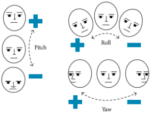
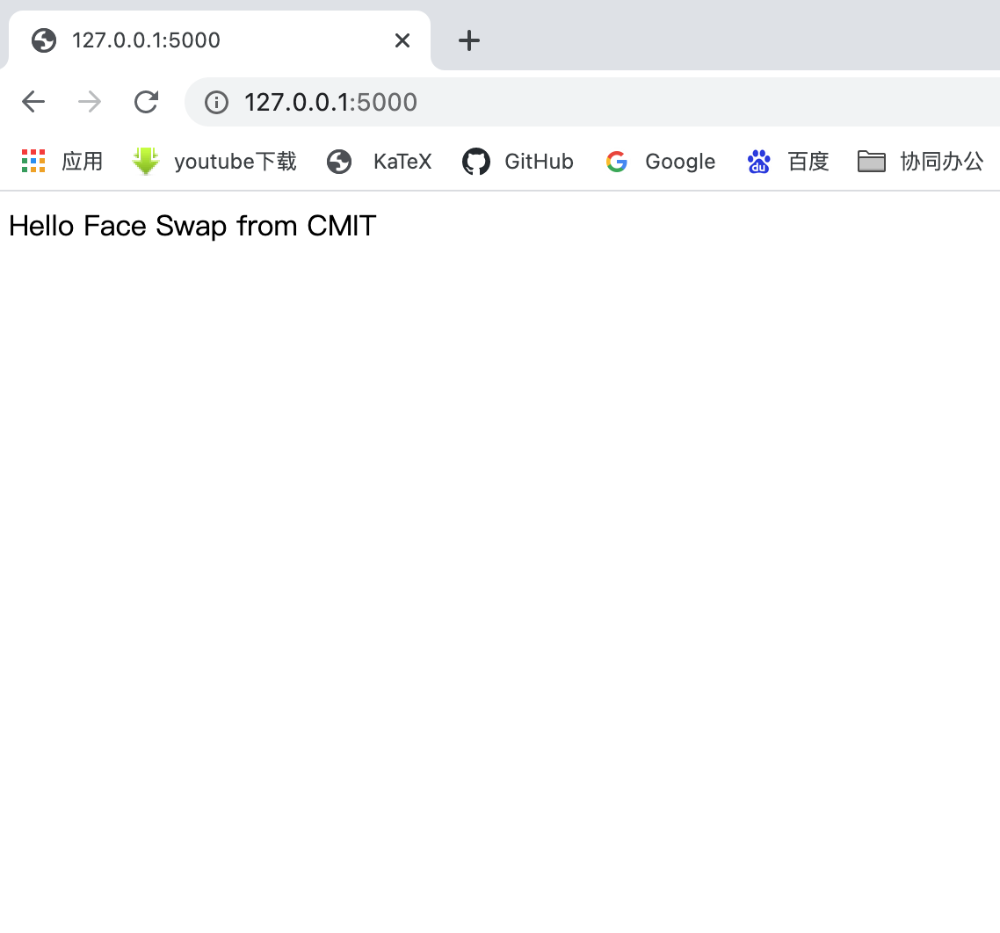
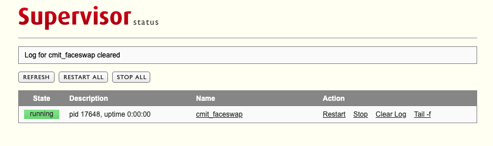

# Face Swap

面部融合应用, 效果如下:     

<table>
  <tr>
     <td align="center">原图</td>
     <td align="center">合成模板</td>
     <td align="center">合成效果图</td>
  </tr>
  <tr>
    <td></td>
    <td></td>
    <td></td>
  </tr>
 </table>

<!--toc-->
- [配置说明](#1-配置说明)
    - [合成模板配置](#11-合成模板配置)
    - [人脸欧拉转动角配置](#12-人脸欧拉转动角配置)
    - [环境变量配置](#13-环境变量配置)
- [部署说明](#2-部署说明)
    - [Docker部署](#21-Docker部署)
    - [supervisor+gunicorn部署](#22-supervisor+gunicorn部署)
- [接口说明](#3-接口说明)
    - [/api/v1/faceswap](#31-apiv1faceswap)
    - [/api/v1/face_detect](#32-apiv1face_detect)
- [更新说明](#4-更新说明)
- [TODO](#5-TODO)

<!-- tocstop -->
## 1. 配置说明
### 1.1 合成模板配置
将面部融合的模板放到`./res/templates`目录下面，并更新`./res/templates/templates.yaml`文件中的模板配置, 如果没有该文件请参考`./res/templates/templates_example.yaml`创建一个

如：该项目中配置了演示用模板template1，并在模板将template1的配置信息写入`./res/templates/templates.yaml`文件中      
```yaml
template1: # 模板名称，这个名称非常重要，后面调用接口的时候需要使用这个名称来查找对应的模板文件
  male: # 男性的模板配置
    img: './res/templates/template1/male/male.jpg'  # 带有头发/头饰的模板
    face: './res/templates/template1/male/male_no_hair.jpg' # 没有带头发的模板
    hair: './res/templates/template1/male/hair.jpg' # 头发/头饰的mask，注意头发/头饰区域为白色，其他部分全部应设置为黑色
  female: # 女性的模板配置
    img: './res/templates/template1/female/female.jpg'  # 带有头发/头饰的模板
    face: './res/templates/template1/female/female_no_hair.jpg' # 没有带头发的模板
    hair: './res/templates/template1/female/hair.jpg' # 头发/头饰的mask，注意头发/头饰区域为白色，其他部分全部应设置为黑色
```
### 1.2 人脸欧拉转动角配置
参考`./res/face/face_example.yaml`创建`./res/face/face.yaml`文件，并在其中配置人脸转动欧拉角的阈值，配置说明如下：    
```yaml
angle:
  pitch: 21 #绕x轴旋转的最大允许角度
  yaw: 21 #绕y轴旋转的最大允许角度
  roll: 90  #绕z轴旋转的最大允许角度，除非把头拿下来，应该旋转不到90度吧🤦‍♀️
```

PS:头部旋转姿态欧拉角说明如下:    



### 1.3 环境变量配置
参照`./.env_example`在项目根目录创建`.env`文件，在`.env`文件中设置环境变量，下面是项目中自带一个.env文件，如果懒的话，可以只替换一下`SECRET_KEY`        

```env
APP_CONFIG=production #部署环境：production-生产环境;development-开发环境；testing-测出环境
SECRET_KEY=fadfascsvasdfahudquerw22wxvZf    # 墙裂建议生产部署的适合替换SECRET_KEY

DLIB_FACE_LANDMARK_SHAPE_FILE_PATH=./res/dlib/shape_predictor_68_face_landmarks.dat #dlib face landmark模型路径
GENDER_PROTOTXT_FILE_PATH=./res/gender/gender_deploy.prototxt   # Caffe性别识别模型路径
GENDER_NET_FILE_PATH=./res/gender/gender_net.caffemodel # Caffe性别识别模型路径

FLASK_APP=cmit_faceswap.py  # flask应用入口入口
TEMPLATES_ROOT=./res/templates  # 模板文件的根目录
TEMPLATES_CONFIG_NAME=templates.yaml    # 模板配置信息
FACE_EULER_ANGLES_THRESH=./res/face/face.yaml   #允许头部转动的最大欧拉角
```
## 2. 部署说明
该项目提供了两种部署方式:   
- Docker部署
- supervisor+gunicorn部署
### 2.1 Docker部署

docker部署默认打印的gunicorn日志为debug日志，生产环境下请修改`boot.sh`中的日志级别    

- 生产环境的gunicorn移除`--log-level=debug --preload`   

```bash
#!/bin/sh

exec gunicorn -b 0.0.0.0:5000 -w 2 cmit_faceswap:app --access-logfile=/cmit_faceswap/log/access.log --error-logfile=/cmit_faceswap/log/error.log --timeout=180 --log-level=debug --preload
```
#### 2.1.1 部署要求
- Docker 18.03+
- 克隆项目到本地
#### 2.1.2 启动docker容器
`./docker-compose.yml`文件是docker的默认配置文件，具体的配置如下:   
```yaml
version: '3.7'
services: 
    webapp:
        build: .
        ports: 
            - "5000:5000"   # 宿主机端口:docker flask应用端口;可以通过修改该配置将docker flask应用的5000端口，映射到宿主机上的其他端口
        env_file: 
            - .env
        restart: always
        volumes: 
            - ./:/cmit_faceswap    # 同步工程文件和docker内部文件
```

一切配置完成之后，在项目根目录执行`docker-compose up -d`即可启动容器；首次启动需要自动安装依赖文件，可能耗时较长      
访问http://{ip}:5000，看到如下页面，表示容器启动成功:       


### 2.2 supervisor+gunicorn部署
以CentOS 7.8 为例

#### 2.2.1 配置部署环境

- 安装前置依赖
```bash
sudo yum -y install epel-release
sudo yum -y install git gcc gcc-c++ cmake3
sudo yum install -y python3 python3-devel python3-pip
sudo yum install -y python python-devel python-pip
sudo yum -y install python-devel numpy python3-numpy
sudo yum -y install gtk2-devel
sudo yum install -y libpng-devel
sudo yum install -y jasper-devel
sudo yum install -y openexr-devel
sudo yum install -y libwebp-devel
sudo yum -y install libjpeg-turbo-devel
sudo yum install -y freeglut-devel mesa-libGL mesa-libGL-devel
sudo yum -y install libtiff-devel
sudo yum -y install libdc1394-devel
sudo yum -y install tbb-devel eigen3-devel
sudo yum -y install boost boost-thread boost-devel
sudo yum -y install libv4l-devel
sudo yum -y install gstreamer-plugins-base-devel
```

- 升级pip3到最新版本
```bash
$ sudo python3 -m pip install --upgrade pip
```

- 安装virtualenv
```bash
$ sudo python3 -m pip install virtualenv
```

#### 2.2.2 创建并激活项目虚拟环境
- 在项目根目录创建项目虚拟环境    
```bash
$ python3 -m virtualenv venv
```

- 激活项目虚拟环境
```bash
$ source venv/bin/activate
```

接下来的操作根据bash并且前的符号来确定是在虚拟环境中执行，还是在普通环境中执行：    
- `$`表示在普通环境中执行
- `(venv) [xxxx]$`表示在虚拟环境中执行
- `deactivate`: 退出虚拟环境
- `source venv/bin/activate`: 激活虚拟环境

#### 2.2.3 在虚拟环境中安装项目依赖文件

安装项目依赖的包
```bash
(venv)[xxxx]$ pip install -r requirements.txt
```

**PS：由于CentOS在图像开发上的支持度很差，此时可能会出现dlib setup.py的错误，没有什么好的解决办法，并根据具体的错误Google了**

#### 2.2.4 安装并配置supervisor
`deactivate`退出虚拟环境    
- 安装supervsior    
```bash
$ sudo yum install supervisor -y
```

- 设置supervisor为开机启动
```bash
$ sudo systemctl enable supervisord
```

- 查看supervisor的状态
```bash
$ sudo systemctl status supervisord
```

- 启动supervisor
```bash
$ sudo systemctl start supervisord
```

- 开放supervisor的web管理页面
`sudo vim /etc/supervisord.conf`打开supervisor的配置文件，将`[inet_http_server]`模块的配置修改为如下所示

```
[inet_http_server]         ; inet (TCP) server disabled by default
port=*:9001        ; (ip_address:port specifier, *:port for all iface)
username=user              ; (default is no username (open server))
password=123               ; (default is no password (open server))
```

使用`sudo systemctl restart supervisord`重启supervisor,此时可以通过`http://{ip}:9001`访问supervisor的配置页面

#### 2.2.5 配置应用
- 查看如何为supervisor配置应用    
`sudo vim /etc/supervisord.conf`,训练文件的最后一行`[include]`添加应用的配置。    
不同的系统安装的supervisor可能有所差异，本例CentOS7.8环境下的`[include]`的配置如下:     
```
[include]
files = supervisord.d/*.ini
```
意思是：用户可以将应用的配置放置在`/etc/supervisord.d`目录下，应用的配置文件格式为`*.ini`

- 创建应用配置    
在`/etc/supervisord.d`目录下创建一个文件`cmit_faceswap.ini`作为应用的配置，文件内容如下:    
```
[program:cmit_faceswap]                                                                     ; 应用名称
command=${项目根目录}/venv/bin/gunicorn -b 0.0.0.0:5050 -w 2 cmit_faceswap:app --timeout=180  ; supervisor启动命令
directory=${项目根目录}                                                                       ; 项目的文件夹路径
startsecs=0                                                                                 ; 启动时间
stopwaitsecs=0                                                                              ; 终止等待时间
autostart=true                                                                              ; 是否自动启动
autorestart=true                                                                            ; 是否自动重启
stdout_logfile=${项目根目录}/logs/gunicorn.log                                                ; log 日志
stderr_logfile=${项目根目录}/logs/gunicorn.err
```
- 最后重启supervisor
当一切搞定之后，执行`sudo systemctl restart supervisord`重启supervisor, 在访问supervisor的web管理界面，看到如下界面，表示应用部署成功



## 3. 接口说明
返回码`code`说明:   

code | 说明
:----- | :----- 
200 | 请求成功，图像检测或合成成功
4100 | 请求的参数有误,具体错误原因详见error
4101 | 人脸检测相关：图像中未检测到人脸
4102 | 人脸检测相关：人脸区域占比过大
4103 | 人脸检测相关：人脸左右转动角度超出配置阈值
4104 | 人脸检测相关：人脸上下转动角度超出配置阈值
4105 | 人脸检测相关：无法检测面部的关键特征点
5300 | 算法内部错误

### 3.1 /api/v1/faceswap
v1版本的面部融合接口
#### 3.1.1 请求说明
- 请求方式**POST**，参数提交的方式为`FormData`

- 参数说明


参数 | 类型 | 是否必填 | 参数说明
:----- | :----- | :----- | :-----
image_ref | base64 str | 是 | 用于合成的图像，使用Base64对图像进行编码；目前仅支持通道为1、3、4的图像；最好提交jpg/jpeg格式的图像，人脸最好正对摄像头
template_name | str | 是 | 提前配置进应用中的模板的名称
gender | str | 否 | 用户性别，可选值只能是`female`或`male`，如果用户提交的为其他的值或者不提交，则应用自动检测提交的图像中的人物性别
swaped_value | int | 否 | 控制合成效果，取值范围为`[11,31]`, 数值越大越接近`image_ref`的风格，越小越接近`template`的风格，如不提交则默认为21
swaped_image_ext | str | 否 | 合成图像的编码格式，默认为`png`，目前只支持`jpg`和`png`

- 返回结果      

参数 | 类型 | 是否必有 | 参数说明
:----- | :----- | :----- | :-----
code | int | 是 | api请求结果状态码：200:请求成功；4100-4105:请求参数有误；5300:服务端错误；
error | str/null | 是 | 请求失败的具体错误信息；当请求成功时为null
swaped_image | base64 str| 是| 面部融合的结果，为Base64编码的jpg图像；当请求失败的时候为null

#### 3.1.2 返回结果示例
- 图像合成成功    
```json
{
    "code": 200,
    "error": null,
    "swaped_image": "data:image/png;base64,iVB...."
```
- 未检测到人脸
```json
{
    "code": 4101,
    "error": "图像中未检测的人脸",
    "swaped_image": null
}
```
- 检测到人脸不满足合成图像的要求
```json
{
    "code": 4103,
    "error": "图像虽然检测到人脸, 但面部旋转角度超出设定阈值, 请不要左右转头, 请正对摄像头",
    "swaped_image": null
}
```
### 3.2 /api/v1/face_detect
人脸检测，检测图像中是否有人脸，以及人脸是否符合图像合成的要求
#### 3.2.1 请求说明
- 请求方式**POST**，参数提交的方式为`FormData`

- 参数说明


参数 | 类型 | 是否必填 | 参数说明
:----- | :----- | :----- | :-----
image_ref | base64 str | 是 | 用于合成的图像，使用Base64对图像进行编码；目前仅支持通道为1、3、4的图像；最好提交jpg/jpeg格式的图像，人脸最好正对摄像头

- 返回结果      

参数 | 类型 | 是否必有 | 参数说明
:----- | :----- | :----- | :-----
code | int | 是 | api请求结果状态码：200-请求成功；4100——4105:请求参数有误；5300:服务端错误；
error | str/null | 是 | 当检测到人脸，并且符合合成要求时为null，否则为人脸检测不通过的原因
face | dict/null| 是| 未检测到人脸是为null，当检测到人脸并且符合人脸合成的要求时，返回人脸信息:{"box": {"left": 273, "top": 273, "width": 523, "height": 523},"euler_angle":{"pitch": 1.0050539078176328, "yaw": -0.5149523936933317, "roll": -0.6179162284853774}}

#### 3.1.2 返回结果示例
- 检测到人脸，且符合合成要求
```json
{
    "code": 200,
    "error": null,
    "face": {
        "box": {
            "left": 273,
            "top": 273,
            "width": 523,
            "height": 523
        },
        "euler_angle": {
            "pitch": 1.0050539078176328,
            "yaw": -0.5149523936933317,
            "roll": -0.6179162284853774
        }
    }
}
```
- 检测到人脸，但是头部左右转动不符合合成要求
```json
{
    "code": 4103,
    "error": "图像虽然检测到人脸, 但面部旋转角度超出设定阈值, 请不要左右转头, 请正对摄像头",
    "face": null
}
```
- 检测到人脸，但是头部上下转动不符合合成要求
```json
{
    "code": 4104,
    "error": "图像虽然检测到人脸, 但面部旋转角度超出设定阈值, 请不要低头或抬头, 请正对摄像头",
    "face": null
}
```


## 4. 更新说明
- **2020-06-06**
    - 使用LUT方法降低seamlessClone时高光过亮的问题
    - 增加人脸检测接口`/api/v1/face_detect`
    - 为`/api/v1/faceswap`接口增加参数
        - 增加`gender`参数，控制合成时使用的模板
        - 增加`swaped_value`参数，控制合成风格
        - 增加`swaped_image_ext`参数，控制合成图像编码
    - 优化识别合成效率，使算法效率提升48%
    - 优化合成效果
    - 修复了大尺寸图像合成的时候算子溢出的问题


## 5. TODO 
- [x] 为v1版本的面部融合方案添加颜色高斯融合方式，解决面部高光区域对Seamless融合算法的影响；
- [ ] 增加v2融合方案，使用面部468点识别方案扩大面部融合区域、优化颜色融合方案


