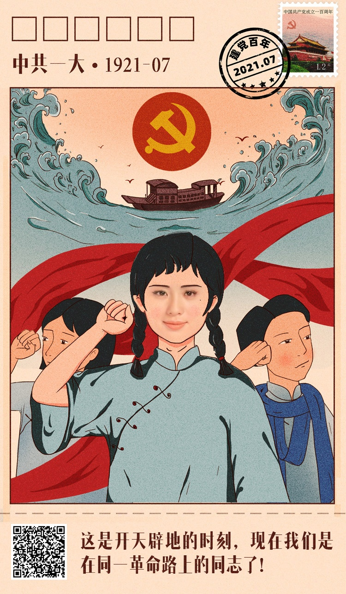

# Face Swap

面部融合应用, 效果如下:     

<div style="text-align: center; ">
    <ul style="display: table">
        <li style="display: table-cell; list-style: none; vertical-align: middle; width:34%"></li>
        <li style="display: table-cell; list-style: none; vertical-align: middle; font-size: xx-large; ">+</li>
        <li style="display: table-cell; list-style: none; vertical-align: middle;width:33%"></li>
        <li style="display: table-cell; list-style: none;  vertical-align: middle; font-size: xx-large">=</li>
        <li style="display: table-cell; list-style: none; vertical-align: middle;width:33%"></li>
    </ul>
    <h6>人脸融合示意</h6>
</div>

## 1. 部署说明
将代码克隆到部署服务器上，按照如下步骤配置自的不更工程
### 1.1 部署要求
- Docker 18.03+
### 1.2 配置面部融合的模板
将面部融合的模板放到`./res/templates`目录下面，并更新`./res/templates/templates.yaml`文件中的模板配置

如：该项目中配置了演示用模板template1，并在模板将template1的配置信息写入`./res/templates/templates.yaml`文件中      
```yaml
template1: # 模板名称，这个名称非常重要，后面调用接口的时候需要使用这个名称来查找对应的模板文件
  male: # 男性的模板配置
    img: './res/templates/template1/male/male.jpg'  # 带有头发的模板
    face: './res/templates/template1/male/male_no_hair.jpg' # 没有带头发的模板
    hair: './res/templates/template1/male/hair.jpg' # 头发模板，注意头发意外的部分全部应设置为白色
  female: # 女性的模板配置
    img: './res/templates/template1/female/female.jpg'  # 带有头发的模板
    face: './res/templates/template1/female/female_no_hair.jpg' # 没有带头发的模板
    hair: './res/templates/template1/female/hair.jpg' # 头发模板，注意头发意外的部分全部应设置为白色
```
### 1.3 配置环境变量
在`./.env`文件中设置环境变量，下面是项目中自带一个.env文件，如果懒得的话，可以只替换一下`SECRET_KEY`        

```env
APP_CONFIG=production #部署环境：production-生产环境;development-开发环境；testing-测出环境
SECRET_KEY=fadfascsvasdfahudquerw22wxvZf    # 墙裂建议生产部署的适合替换SECRET_KEY

DLIB_FACE_LANDMARK_SHAPE_FILE_PATH=./res/dlib/shape_predictor_68_face_landmarks.dat #dlib face landmark模型路径
GENDER_PROTOTXT_FILE_PATH=./res/gender/gender_deploy.prototxt   # Caffe性别识别模型路径
GENDER_NET_FILE_PATH=./res/gender/gender_net.caffemodel # Caffe性别识别模型路径

FLASK_APP=cmit_faceswap.py  # flask应用入口入口
FLASK_ENV=production    # flask应用模式
TEMPLATES_ROOT=./res/templates  # 模板文件的根目录
TEMPLATES_CONFIG_NAME=templates.yaml    # 模板配置信息
```

### 1.4 启动docker容易
`./docker-compose.yml`文件是docker的默认配置文件，具体的配置如下:   
```yaml
version: '3.7'
services: 
    webapp:
        build: .
        ports: 
            - "5000:5000"   # 宿主机端口:docker flask应用端口;可以通过修改该配置将docker flask应用的5000端口，映射到宿主机上的其他端口
        env_file: 
            - .env
        restart: always
        volumes: 
            - ./logs/:/cmit_faceswap/log    # 同步docker flask应用的日志到宿主机的./logs目录
            - ./res/:/cmit_faceswap/res     # 同步docker flask应用的res目录到宿主机的./res目录，容器启动之后可以在宿主机的./res目录下更新flask应用的res资源文件
```

一切配置完成之后，在项目根目录执行`docker-compose up -d`即可启动容器；首次启动需要自动安装依赖文件，可能耗时较长      
访问http://{ip}:5000，看到如下页面，表示容器启动成功:       


## 2. 接口说明
### 2.1 /api/v1/faceswap
v1版本的面部融合接口
- 请求方式**POST**  

- 参数说明

参数 | 类型 | 是否必填 | 参数说明
:----- | :----- | :----- | :-----
image_ref | base64 str | 是 | 用于合成的图像，使用Base64对图像进行编码；目前仅支持通道为1、3、4的图像；最好提交jpg/jpeg格式的图像，人脸最好正对摄像头
template_name | str | 是 | 提前配置进应用中的模板的名称

- 返回结果      

参数 | 类型 | 是否必有 | 参数说明
:----- | :----- | :----- | :-----
code | int | 是 | api请求结果状态码：200-请求成功；4100-请求参数有误；5300-服务端错误；
error | str/null | 是 | 请求失败的具体错误信息；当请求成功时为null
swaped_image | base64 str| 是| 面部融合的结果，为Base64编码的jpg图像；当请求失败的时候为null

## 3. TODO 
- [ ] 为v1版本的面部融合方案添加颜色高斯融合方式，解决面部高光区域对Seamless融合算法的影响；
- [ ] 增加v2融合方案，使用面部468点识别方案扩大面部融合区域、优化颜色融合方案


